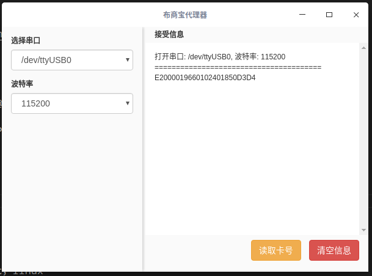

# serialPortProxy 串口代理
一个基于electron、node-serialport开发的串口通讯代理器，网页轻松访问串口中的数据。连接rfid感应器、电子秤等等。

## 原理
通过nodejs的http模块开启http服务，接受请求，可以根据请求的参数，调用对应的连接串口函数（目前已经实现连接rfid感应器），
串口函数负责打开串口读取数据，并将数据返回给http请求。
暂时已经写死了rfid，如果有要连接其他的设备，直接修改串口函数即可。

## 安装与使用




```bash
# 克隆
git clone git@github.com:sjzsdu/serialPortProxy.git
# 进入目录
cd serialPortProxy
# 安装
npm install
# 调试
npm start
# 打包
npm pack
```

## 功能
+ 写入卡号并返回
js访问 $.ajax('http://localhost:9527/rfid/bind')
访问url参数中第一个代表要读取的串口类别，目前只有rfid感应器，其他电子秤可以扩展实现
第二个参数是要执行的操作
返回rfids的代码

+ 读卡号
js访问 $.ajax('http://localhost:9527/rfid/multi')
返回rfids卡号，以（epc|epc）的形式

## NODE_MODULE_VERSION 不一致的问题
可以尝试一下的编译方式解决
```
npm install -g node-gyp
cd ./node_modules/@serialport/bingdings
node-gyp rebuild --target=6.0.10【你安装的electron版本】 --arch=x64 --dist-url=https://atom.io/download/electron
```
编译成功就可以解决这个问题。

## 其他
+ 本代码借鉴 [基于electron的桌面串口工具](https://github.com/PowerDos/electron-serialport)，感谢！
+ 感谢electron和node-serialport项目